# Database ERD — TNVS Facilities & Administrative Management System

**Source of truth:** Supabase `public` schema (`supabase/migrations/00001–00006`, `002`, `003`, `realtime.sql`).
Documentation only — no database, migration, or code was modified.
`FK` marks database-enforced constraints; `logical: <col>` relationships are loose uuid references (no DB FK).
Backend-only Flyway tables (notifications, contract_clauses, user_module_scopes, document_grants, ai_module_config, ai_providers) are intentionally excluded — they are not in the Supabase `public` schema.

```mermaid
erDiagram
    FACILITIES {
        uuid id PK
        text name UK
        text code
        text type
        text address
        text city
        text country
        text timezone
        integer total_capacity
        boolean active
    }
    ROOMS {
        uuid id PK
        uuid facility_id FK
        text room_number
        text name
        text building
        text floor
        integer floor_number
        integer capacity
        text type
        text status
        jsonb equipment
        boolean is_available
        text description
        text maintenance_status
        text maintenance_reason
        text image_url
        boolean has_projector
        boolean has_video_conference
        boolean has_whiteboard
        time open_time
        time close_time
        numeric hourly_rate
        boolean active
    }
    RESERVATIONS {
        uuid id PK
        uuid room_id FK
        uuid user_id
        text title
        text purpose
        text description
        timestamptz start_time
        timestamptz end_time
        integer expected_attendees
        text status
        text approval_status
        text rejection_reason
        text employee_name
        text employee_department
        text employee_email
        text employee_id
        text approved_by
        timestamptz approved_at
        text notes
        text qr_code_token
        timestamptz check_in_time
        timestamptz check_out_time
    }
    MAINTENANCE_SCHEDULES {
        uuid id PK
        uuid room_id FK
        text title
        timestamptz start_time
        timestamptz end_time
        text description
        text status
        text assigned_to
        text reason
        text notes
        uuid facility_id
        uuid equipment_id
    }
    EQUIPMENT {
        uuid id PK
        uuid room_id
        uuid facility_id
        text name
        text serial_number UK
        text category
        text status
        date last_maintenance_date
        date next_maintenance_date
    }
    FACILITY_AMENITIES {
        uuid id PK
        uuid room_id
        text name
        text description
    }
    RESERVATION_APPROVALS {
        uuid id PK
        uuid reservation_id
        uuid approved_by
        text decision
        text comments
        timestamptz decided_at
    }
    VISITORS {
        uuid id PK
        text full_name
        text email
        text phone
        text phone_number
        text company
        text id_number
        uuid host_id
        text host_employee_id
        text purpose_of_visit
        timestamptz expected_arrival
        timestamptz actual_arrival
        timestamptz actual_departure
        text status
        text qr_code_token
        text badge_number
    }
    VISITOR_VERIFICATIONS {
        uuid id PK
        uuid visitor_id
        text id_type
        text id_number
        jsonb extracted_fields
        numeric match_score
        text watchlist_status
        text verification_status
        timestamptz verified_at
        text verified_by
        text notes
    }
    VISITOR_WATCHLIST {
        uuid id PK
        text full_name
        text id_number
        text reason
        text status
    }
    DOCUMENTS {
        uuid id PK
        text title
        text file_name
        text file_type
        bigint file_size
        text file_path
        text supabase_storage_url
        uuid folder_id
        uuid category_id
        uuid retention_policy_id
        text classification_level
        text status
        text owner_email
        text department
        text ai_predicted_category
        text ai_classification
        text ai_summary
        text ocr_extracted_text
        numeric confidence_score
        jsonb extracted_keywords
        integer version_number
        timestamptz retention_expires_at
    }
    FOLDERS {
        uuid id PK
        text name
        uuid parent_id
        text path
    }
    CATEGORIES {
        uuid id PK
        text name UK
        text description
    }
    TAGS {
        uuid id PK
        text name UK
    }
    DOCUMENT_TAGS {
        uuid document_id FK
        uuid tag_id FK
    }
    RETENTION_POLICIES {
        uuid id PK
        text name UK
        text description
        integer retention_period_days
        text action_on_expiry
        boolean active
    }
    CONTRACTS {
        uuid id PK
        text contract_number
        text title
        text type
        text counter_party
        numeric contract_value
        uuid vendor_id
        uuid document_id
        text status
        text ai_assessed_risk_level
        text ai_risk_summary
        date start_date
        date end_date
        date renewal_notice_date
    }
    LEGAL_CASES {
        uuid id PK
        text case_number
        text title
        text court_name
        text case_type
        text status
        text priority
        text description
        text judge_name
        text opposing_party
        uuid lead_lawyer_id
        text lead_counselor
        date filed_date
        date filing_date
        date expected_resolution_date
        date next_hearing_date
        date closed_date
        text resolution_notes
    }
    USERS {
        uuid id PK
        text employee_id UK
        text first_name
        text last_name
        text email UK
        text password_hash
        text phone_number
        text department
        text position
        text avatar_url
        text status
        boolean is_email_verified
        timestamptz email_verified_at
        timestamptz last_login_at
        text last_login_ip
        integer failed_login_attempts
        timestamptz locked_until
        timestamptz last_failed_attempt_at
        text password_reset_token
        timestamptz password_reset_expires_at
    }
    ROLES {
        uuid id PK
        text name UK
        text display_name
        text description
        boolean is_system_role
    }
    PERMISSIONS {
        uuid id PK
        text name UK
        text display_name
        text description
        text module
        text resource
        text action
    }
    USER_ROLES {
        uuid user_id FK
        uuid role_id FK
    }
    ROLE_PERMISSIONS {
        uuid role_id FK
        uuid permission_id FK
    }
    REFRESH_TOKENS {
        uuid id PK
        uuid user_id
        text token UK
        timestamptz expires_at
        boolean is_revoked
        timestamptz revoked_at
        text ip_address
        text user_agent
    }
    AUDIT_LOGS {
        uuid id PK
        uuid user_id
        text user_email
        text user_full_name
        text action
        text entity_type
        text entity_id
        text entity_name
        text module
        text description
        text old_values
        text new_values
        text ip_address
        text user_agent
        text severity
        text status
    }
    SECURITY_LOGS {
        uuid id PK
        text action
        text module
        text full_name
        text role
        text ip_address
        text risk_level
        text status
        text reason
        text user_id
        text department
        text device_name
        text browser
        text operating_system
        text session_id
        text request_id
        text api_endpoint
        text http_method
        text affected_record
        text previous_value
        text new_value
        text geo_location
    }
    LOGIN_HISTORY {
        uuid id PK
        text username
        text user_id
        text ip_address
        text user_agent
        text status
        text failure_reason
        text device_fingerprint
        text location
    }
    API_REQUEST_LOGS {
        uuid id PK
        text ip_address
        text url
        text method
        integer status_code
        bigint response_time_ms
        text user_agent
        bigint payload_size_bytes
        text user_id
    }
    ACTIVE_SESSIONS {
        uuid id PK
        text session_id
        text user_id
        text username
        text full_name
        text role
        text ip_address
        text country
        text browser
        text device_name
        timestamptz login_time
        timestamptz last_activity
        text status
    }
    BLOCKED_IPS {
        uuid id PK
        text ip_address
        text reason
        text blocked_by
        timestamptz blocked_at
        timestamptz expires_at
        text status
        bigint attempts_count
    }
    SECURITY_ALERTS {
        uuid id PK
        text title
        text description
        text alert_type
        text severity
        text target_ip
        text target_user_id
        text status
        text resolved_by
        timestamptz resolved_at
    }
    IP_THREATS {
        uuid id PK
        text ip
        text country
        text city
        double latitude
        double longitude
        text threat_type
        text severity
        integer requests
        text status
        timestamptz first_seen
        timestamptz last_seen
        text asn
        text isp
        text flag
    }
    ADMIN_NOTIFICATIONS {
        uuid id PK
        text title
        text message
        text type
        text severity
        boolean read
        timestamptz expires_at
    }
    BACKUP_RECORDS {
        uuid id PK
        text backup_type
        text status
        timestamptz started_at
        timestamptz completed_at
        bigint file_size
        text file_path
        text integrity_check
        text triggered_by
        text notes
    }
    INTEGRATION_STATUS {
        uuid id PK
        text system_name UK
        text connection_status
        timestamptz last_sync_at
        text api_health
        bigint response_time_ms
        integer failed_syncs
        timestamptz last_successful_connection
    }
    SYSTEM_CONFIGURATIONS {
        uuid id PK
        text config_key UK
        text config_value
        text description
        text category
    }
    COMPLIANCE_ALERTS {
        uuid id PK
        text type
        text severity
        text title
        text message
        text entity_type
        text entity_id
        text status
        text dedup_key UK
        text acknowledged_by
        timestamptz acknowledged_at
    }
    DISPOSAL_REQUESTS {
        uuid id PK
        uuid document_id
        text document_title
        text reason
        text status
        text decision_notes
        text decided_by
        timestamptz decided_at
        text retention_policy_name
    }
    EMPLOYEE_NOTIFICATIONS {
        uuid id PK
        uuid recipient_id FK
        text title
        text message
        text type
        boolean is_read
        text related_entity_type
        text related_entity_id
    }
    EMPLOYEE_REQUESTS {
        uuid id PK
        uuid requester_id FK
        text type
        text title
        text description
        text status
        text decision_notes
    }
    LEGAL_NOTICES {
        uuid id PK
        text type
        text severity
        text title
        text message
        text entity_type
        text entity_id
        text status
        text dedup_key UK
        text acknowledged_by
        timestamptz acknowledged_at
    }
    VENDORS {
        uuid id PK
        text vendor_code UK
        text name
        text category
        text contact_name
        text contact_email
        text contact_phone
        text address
        text status
        integer performance_score
        numeric sla_compliance_rate
        text notes
    }
    VENDOR_OBLIGATIONS {
        uuid id PK
        uuid vendor_id FK
        text title
        text description
        date due_date
        text status
        text notes
    }
    PROCUREMENT_NOTICES {
        uuid id PK
        text type
        text severity
        text title
        text message
        text entity_type
        text entity_id
        text status
        text dedup_key UK
        text acknowledged_by
        timestamptz acknowledged_at
    }
    HR_ASSISTANCE_REQUESTS {
        uuid id PK
        text requester_name
        text requester_email
        text subject
        text message
        text status
        text priority
        text ip_address
        text user_agent
    }
    RATE_LIMIT_COUNTS {
        bigint id PK
        text limit_key
        bigint window_start
        integer request_count
    }
    USER_ACTIVITY_EVENTS {
        bigint id PK
        text event_type
        text user_id
        text username
        text full_name
        text email
        text role
        text action
        text ip
        text device
        text browser
    }
    ONLINE_USERS {
        bigint id PK
        text username UK
        text user_id
        text full_name
        text role
        text ip
        text device
        text browser
        timestamptz last_activity
    }

    FACILITIES ||--o{ ROOMS : "contains"
    ROOMS ||--o{ RESERVATIONS : "booked by"
    ROOMS ||--o{ MAINTENANCE_SCHEDULES : "scheduled"
    VENDORS ||--o{ VENDOR_OBLIGATIONS : "has"
    USERS ||--o{ EMPLOYEE_NOTIFICATIONS : "receives"
    USERS ||--o{ EMPLOYEE_REQUESTS : "submits"
    USERS ||--o{ USER_ROLES : "has"
    ROLES ||--o{ USER_ROLES : "assigned"
    ROLES ||--o{ ROLE_PERMISSIONS : "has"
    PERMISSIONS ||--o{ ROLE_PERMISSIONS : "grants"
    DOCUMENTS ||--o{ DOCUMENT_TAGS : "tagged"
    TAGS ||--o{ DOCUMENT_TAGS : "used by"
    USERS ||--o{ RESERVATIONS : "logical: user_id"
    USERS ||--o{ VISITORS : "logical: host_id"
    USERS ||--o{ LEGAL_CASES : "logical: lead_lawyer_id"
    USERS ||--o{ REFRESH_TOKENS : "logical: user_id"
    USERS ||--o{ AUDIT_LOGS : "logical: user_id"
    USERS ||--o{ ACTIVE_SESSIONS : "logical: user_id"
    USERS ||--o{ RESERVATION_APPROVALS : "logical: approved_by"
    ROOMS ||--o{ EQUIPMENT : "logical: room_id"
    FACILITIES ||--o{ EQUIPMENT : "logical: facility_id"
    ROOMS ||--o{ FACILITY_AMENITIES : "logical: room_id"
    RESERVATIONS ||--o{ RESERVATION_APPROVALS : "logical: reservation_id"
    FOLDERS ||--o{ FOLDERS : "logical: parent_id"
    FOLDERS ||--o{ DOCUMENTS : "logical: folder_id"
    CATEGORIES ||--o{ DOCUMENTS : "logical: category_id"
    RETENTION_POLICIES ||--o{ DOCUMENTS : "logical: retention_policy_id"
    DOCUMENTS ||--o{ CONTRACTS : "logical: document_id"
    VENDORS ||--o{ CONTRACTS : "logical: vendor_id"
    DOCUMENTS ||--o{ DISPOSAL_REQUESTS : "logical: document_id"
    VISITORS ||--o{ VISITOR_VERIFICATIONS : "logical: visitor_id"
    USERS ||--o{ USER_ACTIVITY_EVENTS : "logical: user_id"
    USERS ||--o{ ONLINE_USERS : "logical: user_id"
```

